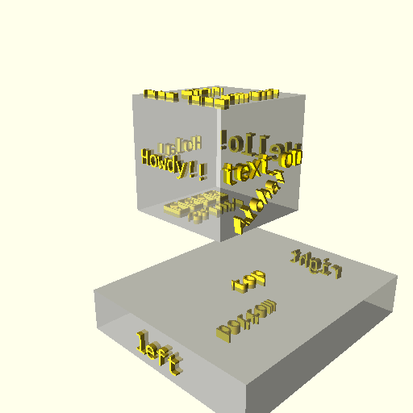
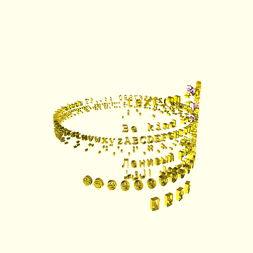
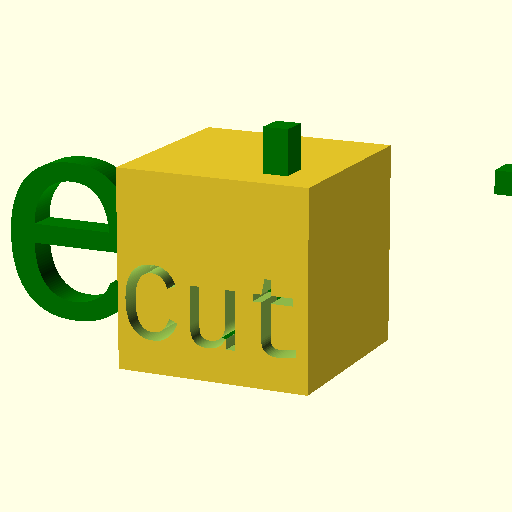
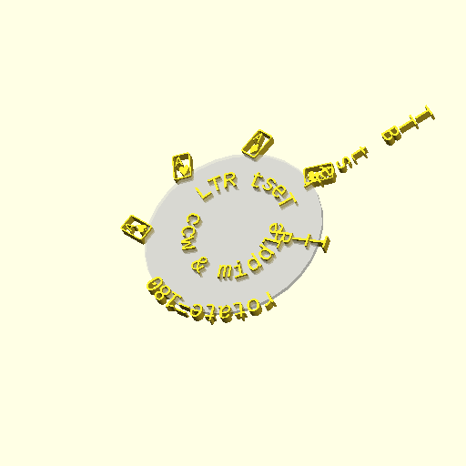
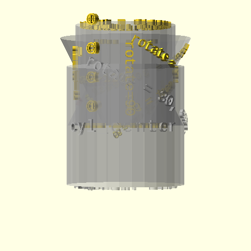
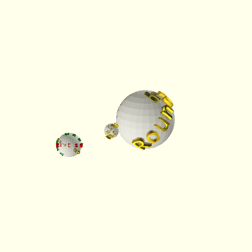
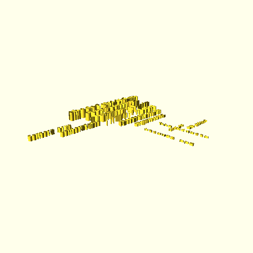

text_on_OpenSCAD
================

A library for putting customised "text on" 3D shapes in OpenSCAD with changeable fonts, languages/scripts, text direction.

Only works with OpenSCAD v 2014.xx and later -- where text() module is added and unicode text is supported. The text module is still an experimental feature in newer releases and must be enabled at run time (--enable=text).

This is a rewrite and extension of the great write.scad (v3 from http://www.thingiverse.com/thing:16193) to use the new OpenSCAD internal text() primitive.
* All credit to Harlan Martin (harlan@sutlog.com) for his great effort on the original.
* Great thanks to @t-paul (and the OpenSCAD dev team) on adding the new text() primitive giving us other fonts.

Functions are provided for putting text on:
* Spheres
* Cylinders (including unequal top and bottom radii)
* Cubes
* Circles

Text can be unicode charaters and in any font (installed on your system), language (e.g. "en","cn","jp"), script (e.g. "arabic","hiragana"), size and direction ("ttb", "btt", "rtl", "ltr").

There are examples in the /examples directory to get you started. See below for some image renders.

## Installation and Usage

### Option 1 (Quick)
* Copy text_on.scad into the same directory as your .scad file.
* Add "use <text_on.scad>" to your .scad file.

### Option 2 (Nicer)
* Copy (or link) the "text_on" directory into your OpenSCAD library directory (In OpenSCAD File/Library Folder will show you where it is).
* Add "use <text_on/text_on.scad>" to your .scad file.

## Module Arguments

See the top comments section in of text_on.scad for the module definition

The modules use the arguments with the same name as their underlying shapes in order to define the dimensions of the object to put "test_on (e.g. sphere() uses r, so does text_on_sphere() ).

They also expose the arguments of the text() primitive:
* t
* size
* spacing
* font
* direction -- ltr, ttb, btt or rtl
* language
* script
* halign -- left, right or center
* valign -- baseline, bottom, top or center

And additional arguments:
* extrusion_height //i.e. how far it sits proud
* rotate
* center //center the text at the location it is being written (NOT that the object is centered)
* locn_vector //Where the faux-object has been translated to.

### Quick Example - Text On Sphere

    %sphere(r=15); //Partially visible "base" object
    text_on_sphere("Hello World",r=15);

### Quick Example - Text On Cylinder

    %cylinder(r1=rad1,r2=rad2,h=40); //Partially visible "base" object
    text_on_cylinder(t="Text",r1=rad1,r2=rad2,h=40, font="Liberation Mono", direction="ttb", size=5);

## Example Images

The examples in /examples produce the following:

text_on_cube.scad

text_on_font.scad.png

text_on_circle.scad.png

text_on_cylinder.scad.png

text_on_sphere.scad.png

text_extrude.scad

## Development

Please fork from at https://github.com/brodykenrick/text_on_OpenSCAD and fix any bugs or add any features and send a pull request.

